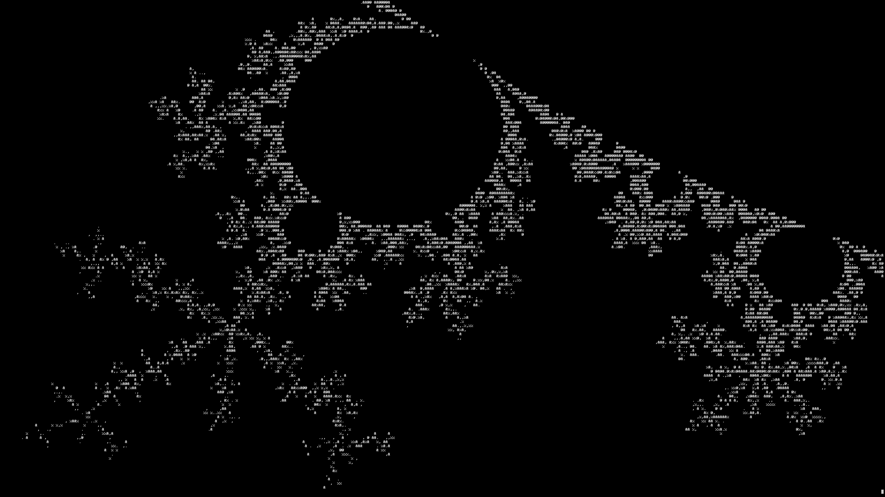

# fracterm
An interactive escape-time fractal explorer made for the terminal. Graphics are very simple! It does mean that you never get the resolution above the dimensions of your terminal, however this is not the point.
Noone is seeking an ascii explorer for the details; the point is the ability to have a powerful tool, rendered in a simplistic, artistic, expressionist way.

Supporting zooms up to 1.0^-150 *[given a reference point]*


*more images in misc/*

# INSTALL
Dependencies: [*dev packages*]
```
GNU Multiple Precision Arithmetic Library (GMP)
Ncurses
```
Compilation:
```
git clone https://github.com/dovskyi/fracterm
cd fracterm
g++ fracterm.cpp -o fracterm -std=c++17 -l ncurses -l tinfo -l gmpxx -l gmp -O3 -march=native -funsafe-loop-optimizations
```
For permanent install, put the binary [or whole repo] in */usr/local/bin*
# USAGE

```
fracterm [flags]
```
Flags:
```
-h | display this message
-d | set all default
-f | set fractal [default:mandelbrot]
    <mandelbrot, burning_ship, custom_formula>
    [no perturbation for burning ship yet]
-c | set color   [default:DEM]
    <DEM, dwell, custom_color>
-i | set iterations
-b | set bailout
-m | set mode    [default:explore]
    <explore>
    <zoom [real] [imag]>

For detailed flag description, visit
misc/flags
```
Terminal controls:
```
    k/j: up/down
    h/l: left/right
    +/-: zoom in/out
    q: quit
```
# Note & TD
I have a lot of fun making this project, and I will continue to add more features and optimizations until I hit my math ceiling [or get bored]. Most math stuff in here is based on documentation from great sources/people, translated into code. This means if I can understand it, I can code it. There are a lot of features I want to add, and I will do so periodically.

In v0.2 I finally added perturbation and DEM coloring method. Took 2 entire months to program this, but I am proud of the result. There are also a ton of new, small features; the program is unrecognizable from v0.1. The main issue right now is performance. I am hoping multithreading will fix it, we will see. I have never actually programmed multithreaded programs, so I need to do research first. But for now, shallow zooms (>1.0^-16) provide exceptional images, better than anything I could expect from ASCII graphics.

Current TD:
* Multi-threading
* Taylor series approximation
* More fractals
* Ffmpeg video export
* Ministatus, menus, etc.
