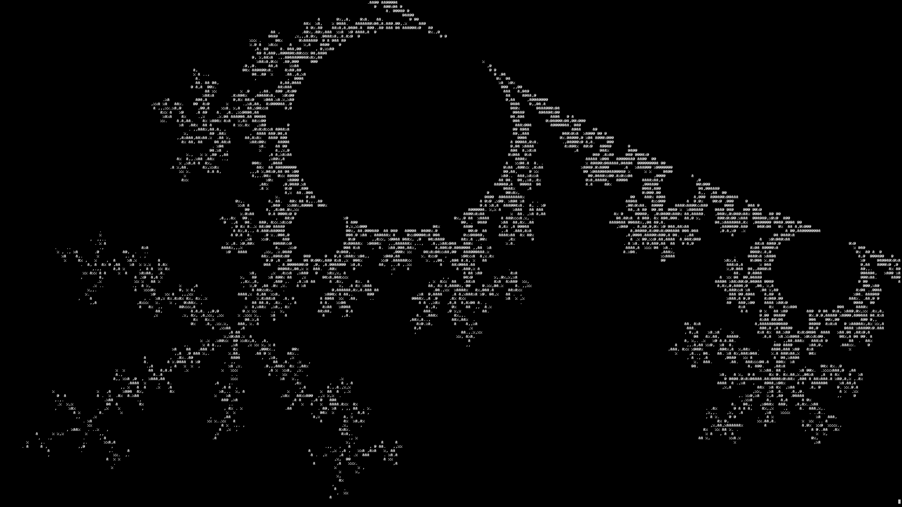

# fracterm
An interactive escape-time fractal explorer made for the terminal. Graphics are very simple! It does mean that you never get the resolution above the dimensions of your terminal, however this is not the point.
Noone is seeking an ascii explorer for the details; the point is the ability to have a powerful tool, rendered in a simplistic, artistic, expressionist way.

Supporting zooms up to 1.0^-150 *[given a reference point]*

Read development process at [dovskyi.org](https://dovskyi.org/src/projects.php#1016)


*more images in misc/pictures*

# INSTALL
**Only supported on GNU/Linux**

Dependencies: [*dev packages*]
```
GNU Multiple Precision Arithmetic Library (GMP)
Notcurses

+ Make & gcc
```

Compilation:
```
git clone https://github.com/dovskyi/fracterm
cd fracterm
make all
```
For permanent install, put the binaries [or whole repo] in */usr/local/bin*

To uninstall binaries, do *make clean*

# USAGE

```
fracterm [flags]
```
Flags:
```
-h | display this message
-d | set all defaults
-f | set fractal [default:mandelbrot]
    <mandelbrot, burning_ship, custom_formula>
    [perturbation only for mandelbrot currently]
-c | set color   [default:DEM]
    <DEM, dwell, custom_color>
-i | set iterations
-b | set bailout
-t | set threads [default:hardware max]
-w | write all frames into a binary file
    <file name/path>
    [view using cinematograph]
-m | set mode    [default:explore]
    <explore>
    <zoom [real] [imag]>

For detailed flag description, visit
misc/docs
```
Terminal controls:
```
    k/j: up/down
    h/l: left/right
    +/-: zoom in/out
    q: quit
```
Cinematograph *(Only for version 0.3)*:
```
    cinematograph [file path] <fps>

    <fps> | An integer in range 4-48
                       [24: default]
    In window:
    a/d: forward/backward
    q  : quit
```
# Note & TD
I have a lot of fun making this project, and I will continue to add more features and optimizations until I hit my math ceiling [or get bored]. Most math stuff in here is based on documentation from great sources/people, translated into code. This means if I can understand it, I can code it. There are a lot of features I want to add, and I will do so periodically.

v0.3, I added multithreading. That is something I was putting on the side for a while, but it was... simpler than I thought. Harder part was making a queue that functioned as a collection of callables. I borrowed some reference material for that, but implementation is mine. Everything works on void pointers and wrapper functions that dereference the said pointer.

Current TD:
* Automatic reference picking
* Series approximation [derived already]
* Ministatus, menus, etc.
* More fractals
* Ffmpeg video export
* Document with program explanations, for myself and whoever is curious
